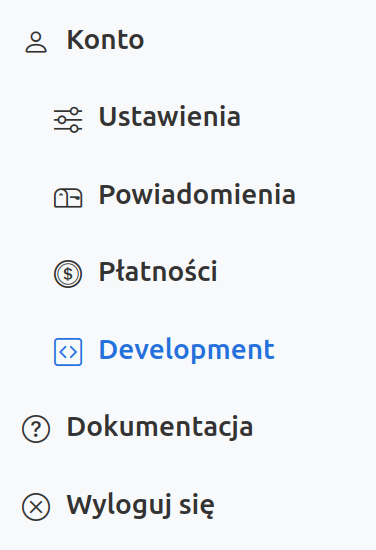
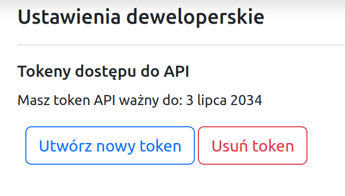

<!-- metadata
title:API Token
--->
# API token

Opcja `Development` w menu webaplikacji Signomix umożliwia utworzenie tokena API. 
 
Ten token może być używany do autentykacji zapytań do API Signomiksa zamiast tokena sesyjnego. Zastosowanie tokena API upraszcza tworzenie skryptów lub programów klienckich. W odróżnieniu od tokena sesyjnego, nie ma potrzeby wcześniejszego logowania się do API, pobierania tokena sesyjnego i obsługi błędów powodowanych przez wygaśnięcie sesji.

Przykład zastosowania: pobieranie danych odebranych ze źródła danych

<pre class="border shadow p-2  bg-light">
curl -H "Accept: application/json" \
-H "Authentication: sgx_token" \
"https://cloud.signomix.com/api/provider/v2/device/01020304/*?query=last%201"
</pre>

W powyższym skrypcie należy:
- w miejsce `sgx_token` wstawić utworzony dla swojego konta token API,
- zamiast przykładowego EUI `01020304` wstawić EUI swojego źródła danych.